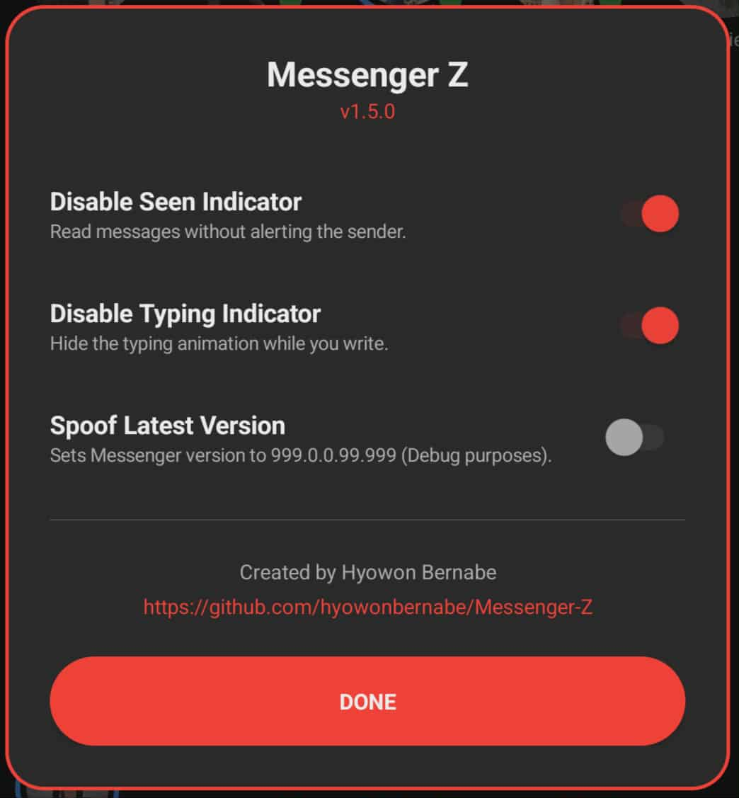

# Messenger Z

   

**Messenger Z** is a non-root modification of Meta's Messenger (`com.facebook.orca`). It is
an Xposed module baked statically into the Messenger APK with **LSPatch**, so it needs no
root and no separate manager app. It adds privacy features (hide the seen and typing
indicators, recover unsent messages) and **installs alongside the Facebook app**.

<p align="center">
  
</p>

---

## ⚡ Features

*   **👻 No Seen** — read messages without sending the read receipt.
*   **⌨️ No Typing** — hide the "…" typing indicator while you write.
*   **🗑️ Unsent Message Logger** — keep a copy of messages that were sent then removed.
*   **🧪 Spoof Version** — report a very high app version (handy when Meta blocks an old build).
*   **🛠️ Debug Console** — a tap-through, in-app overlay that shows Messenger's internal
    signals live. Used to re-find the hook ids after a Messenger update (see Maintenance).
*   **🎨 Native UI** — dark, programmatically-generated settings (no resource conflicts),
    opened by long-pressing the **Messenger** title.
*   **🤝 Coexists with Facebook** — installs while the Facebook app is present.
*   **🔒 Non-root** — static LSPatch patching, works on any device.

---

## 📥 Installation

1.  Grab the latest **`MessengerZ-*.apk`** from [Releases](../../releases), or add this repo
    to [Obtainium](https://github.com/ImranR98/Obtainium) for automatic updates.
2.  Uninstall the official **Messenger** app (same package name). You can keep the
    **Facebook** app installed.
3.  Install the APK.

> Pre-release builds are automated and unverified — a confirmed-working build is published
> as the latest (non-pre-release) version.

---

## ⚙️ Usage

1.  Open Messenger.
2.  **Long-press** the large **"Messenger"** title at the top-left.
3.  The **Messenger Z** menu appears — toggle features instantly.

---

## 🔄 Releases & automation

Builds are produced by GitHub Actions (`.github/workflows/build.yml`): every two weeks
(1st/15th) and on manual dispatch, it detects the latest stable Messenger, patches it, and
publishes a **pre-release**. A maintainer verifies the hooks (via the Debug Console) and
un-marks it as pre-release to ship. See [`docs/maintenance.md`](docs/maintenance.md).

---

## 🧠 How it works

Messenger Z is an Xposed module injected statically with LSPatch. It hooks Messenger's
native messaging bridge, `com.facebook.sdk.mca.MailboxSDKJNI`, which routes operations
through `dispatch…` methods like `dispatchVOOOO(int commandId, …)`.

*   **No Seen / No Typing** match a specific `(method, commandId)` and drop the call.
*   The `dispatch…` **method names are signature-encoded and stable** across versions; the
    **numeric command ids drift** when Meta reorders MSYS procedures. That is the usual cause
    of a feature breaking after an update.
*   UI is built in pure Kotlin and attached by hooking `View.setContentDescription`.
*   **Facebook coexistence**: the build strips the two signature-level permissions Messenger
    shares with `com.facebook.katana`, avoiding `INSTALL_FAILED_DUPLICATE_PERMISSION`.

Current command ids are tracked in [`docs/hook-ids.md`](docs/hook-ids.md).

---

## 🛠️ Building & maintaining

Full runbook (including how to re-resolve hook ids after a Messenger update): see
[`docs/maintenance.md`](docs/maintenance.md). In short:

```bash
# 1. Build the module
./gradlew :app:assembleDebug
# 2. Strip perms + sign + embed into the latest Messenger (downloads it via uptodown)
bash tools/fetch-messenger.sh download messenger.apk
bash tools/build-ci.sh messenger.apk app/build/outputs/apk/debug/app-debug.apk dist
```

**Prerequisites:** JDK 21 (Android Studio's JBR works — LSPatch needs 21), Android SDK,
and the pinned jars under `tools/` (`apkeditor`, `uber-apk-signer`, `lspatch`).

**When a feature breaks after an update:** install the build, open the **Debug Console**,
perform the action (read a message / type), read the new `id`, update the constant in the
matching `features/*.kt`, and log it in `docs/hook-ids.md`.

---

## 🤝 Credits

*   **Creator:** [Hyowon Bernabe](https://github.com/hyowonbernabe)
*   **Reference/Inspiration:** [MessengerPro by Mino260806](https://github.com/Mino260806/MessengerPro)
*   **Tools:** [LSPatch](https://github.com/LSPosed/LSPatch), [APKEditor](https://github.com/REAndroid/APKEditor), [uber-apk-signer](https://github.com/patrickfav/uber-apk-signer)

---

## ⚠️ Disclaimer

For educational and research purposes only. Not affiliated with, endorsed by, or connected
to Meta Platforms, Inc. Modifying and re-signing the app may violate Meta's terms of
service. Use at your own risk.
